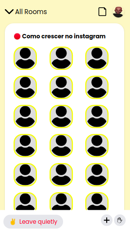

# Um Clone do App Clubhouse

## Demonstração:

## Techs - Tecnologias envolvidas:
* [ ] HTML
* [ ] TailwindCSS

## Contribuições externas:
### 1) Maik Brito:
    Este protótipo só foi possível com a contribuição do Maik Brito. Será bem útil para o meu portfólio.
    Caso queiram conhecer o excelente trabalho do Maik Brito, tanto no âmbito individual, quanto pela Rocketseat, seguem links:
    * Youtube - Maik Brito: https://www.youtube.com/c/MaykBrito/featured
    * Youtube - Rocketseat: https://www.youtube.com/c/RocketSeat/featured

## 2) Imagens:
    Algumas imagens foram obtidas de:

## a) Flaticon: 
    Paper: 
Icons made by <a href="https://www.freepik.com" title="Freepik">Freepik</a> from <a href="https://www.flaticon.com/" title="Flaticon">www.flaticon.com</a>

    Plus: 
Icons made by <a href="https://www.flaticon.com/authors/dmitri13" title="dmitri13">dmitri13</a> from <a href="https://www.flaticon.com/" title="Flaticon">www.flaticon.com</a>

    
    Hand: 
Icons made by <a href="https://www.freepik.com" title="Freepik">Freepik</a> from <a href="https://www.flaticon.com/" title="Flaticon">www.flaticon.com</a>

    Arrow Down: 
Icons made by <a href="https://www.freepik.com" title="Freepik">Freepik</a> from <a href="https://www.flaticon.com/" title="Flaticon">www.flaticon.com</a>

    User= 
Icons made by <a href="https://www.flaticon.com/authors/kiranshastry" title="Kiranshastry">Kiranshastry</a> from <a href="https://www.flaticon.com/" title="Flaticon">www.flaticon.com</a>

## 3) Author:
**Ricardo de Almeida**, tutoriado pelo **Maik Brito**.